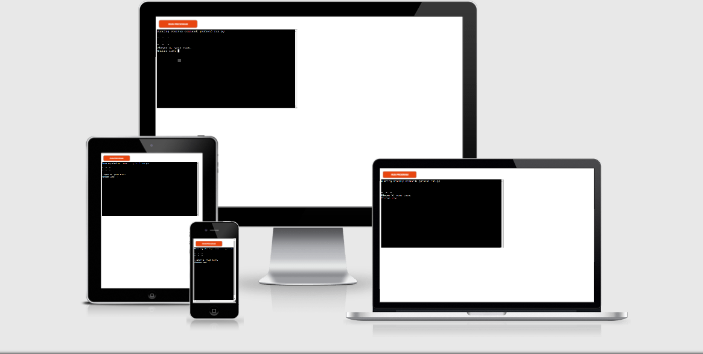
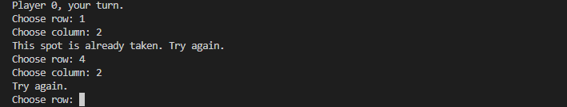

# Tic Tac Toe

This is my Tic Tac Toe game, which runs in the Code Institute mock terminal on Heroku

In this game you can play against a friend you have in real life or any person you know.

[Here is the live version of my project](https://my-tic-tac-toe-gamee.herokuapp.com/)

## How to play

There are 3 rows, and each row has columns from 1-3.

You and your friend play as Player 'X' and Player '0'. 

Player 'X' starts the game by choosing which row and column.

The board will print out and player 'X' will see where he placed his marker.

The game goes on until there is a winner or when it end with a tie.

Have fun!

## Features

### Existing Features

- Input validation error-checking

  - You cannot enter rows or columns outside of 1-3

### Future Features

- Have a best of three feature with a scoreboard
- A restart or quit option

## Testing

I have manually tested this project by doin the following:

- Passed the code through a PEP8 linter and confirmed there are no problems
- Tested in my local terminal and the Code Institute Heroku terminal.

## Bugs

### Solved bugs

- When i wrote my code and tried to run it, i got error messages because the indentation was wrong. I fixed 
this by right clicking on the code, then ''Format document with python''.

### Remaining Bugs

- No bugs remaining

### Validator Testing

- PEP8
   - No errors were returned PEP8online.com

## Deployment

This project was deployed using Code Institute's mock terminal for Heroku.

- Steps for Deployment
   - Fork or clone this repository
   - Create a new Heroku app
   - Set the buildhacks to Python and NodeJS, in that order
   - Link the Heroku app to the repository
   - Click on Deploy

## Credits 

- Code Institute for the deployment terminal